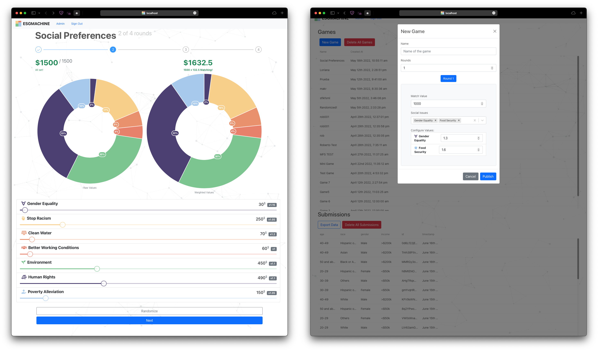

# Social-Issue Ranking Game

Data science analysis toolkit

Features:

- Allows users to input & rank social issues, prioritizing what they find to be most important
- Multiple game modes to input data (point-based-allocation, sort-to-rank)
- Admin CMS / Dashboard to manage game configurations, and export submitted responses via a CSV file
