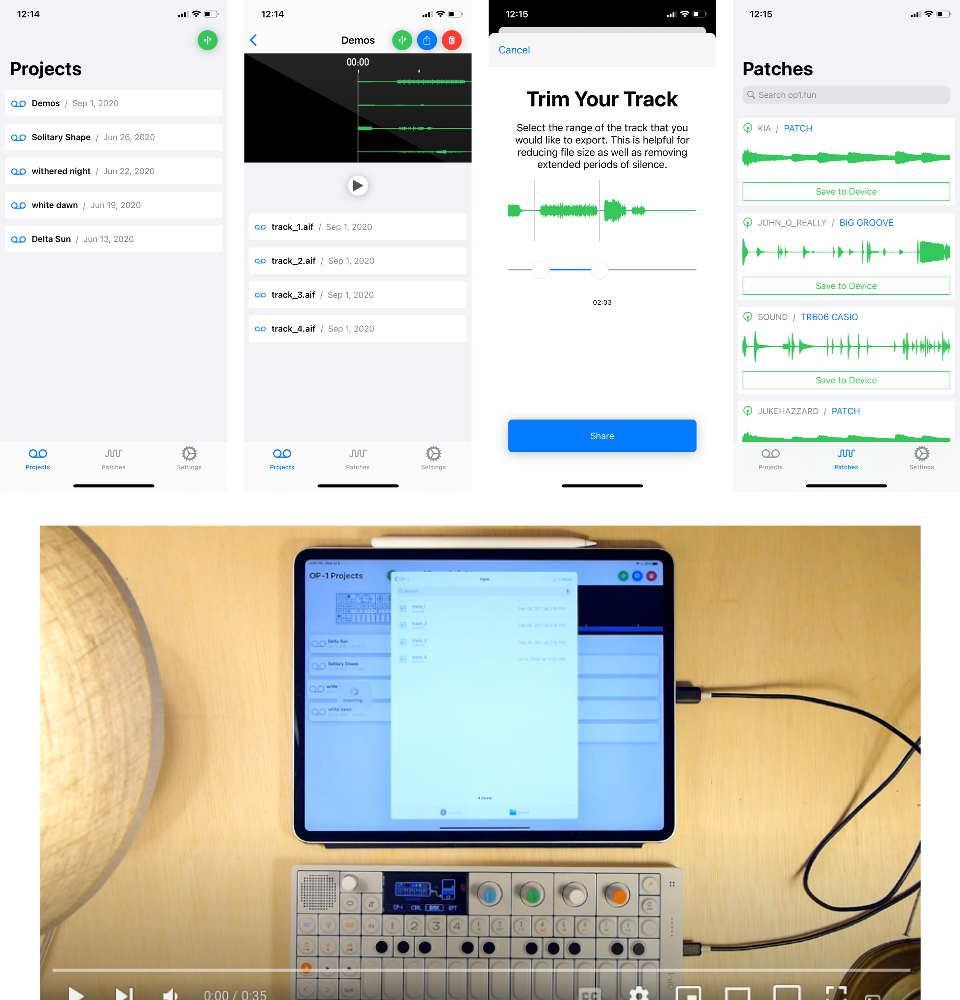

# OP-1 Manager

OP-1 Manager is the quickest and easiest way to sync, save, and share your OP-1 Projects. By connecting your device over USB you can import and export all four tracks to and from your OP-1.
Key features include:

• Syncs projects with iCloud Drive
• Cross-platform iOS / iPadOS / MacOS support
• Import and export all 4 tracks to and from your OP-1
• Easily export stereo files of your projects to quickly share
• Preview your projects by seamlessly playing back all 4 tracks at once
• Conveniently import and export projects through the app over USB
