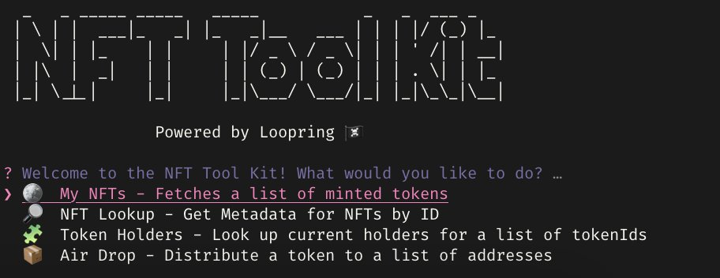

# NFT Tool Kit

A command line utility for interacting with NFTs on the Loopring network

Features:

📦 Air Drop - Distribute a token to a list of addresses

🪙 My NFTs - Get a list of minted tokens

🧩 Token Holders - Look up current holders for a list of tokenIds

👾 ENS Resolver - Get addresses for a list of ENS domains

[View on Github](https://github.com/willsmillie/nfttoolkit)
