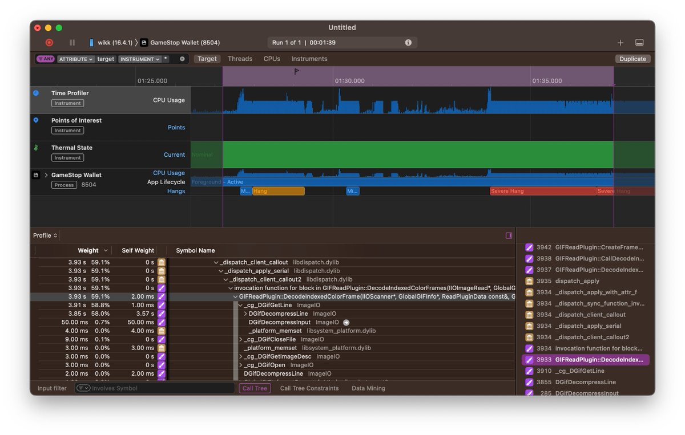

# GameStop Wallet Memory Leak

Following the launch of GameStop's wallet a bug persisted which caused the device to freeze up and crash.

After doing little research, it ultimately ended up being due to a memory overflow while allocating GIFs (FLAnimatedImage?)

I tried to file a bug report in-app (feedback), along with reaching out to their team through various channels.
