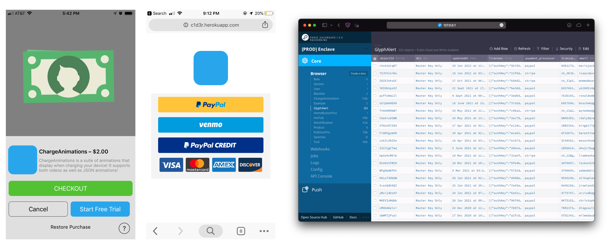

# Enclave

A static library for iOS jailbreak extensions, REST API, and dashboard, implementing as a Digital Rights Management (DRM) to facilitate payment transactions on iOS outside of the App Store. It allows customers to securely and safely purchase my software via PayPal & Stripe, allowing them to activate the software on their devices.
