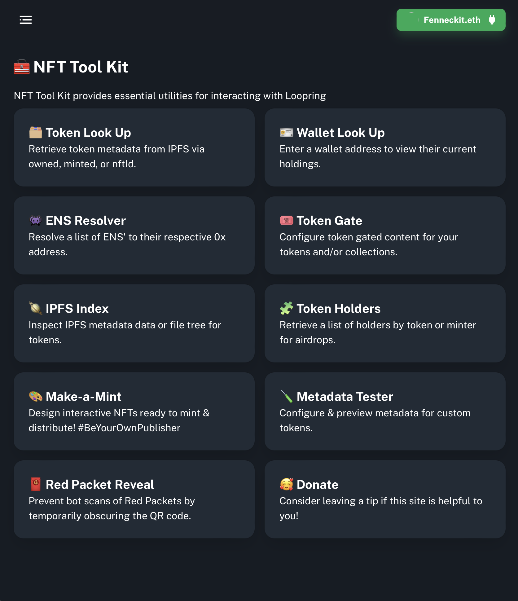

# NFT Tool Kit

What started as a command line utility for interacting with NFTs on the Loopring network evolved into a fully-fledged dApp allowing creators to quickly obtain data about NFTs, useful for targeting airdrops, inspecting metadata, looking up a current users tokens, etc...

[Try it out](https://nfttoolk.it)

[View on Github](https://github.com/willsmillie/nfttoolkit-web)
